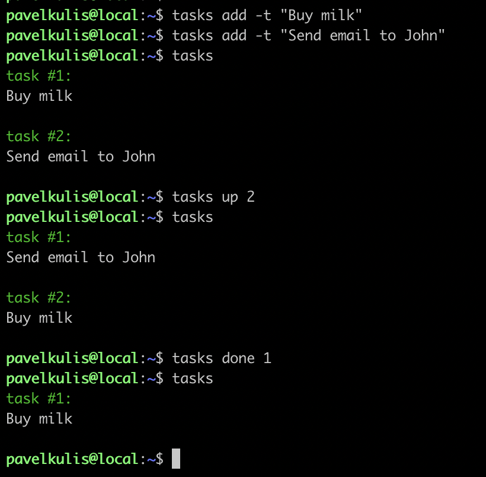

# task_manager
Task manager with simple cli

## Example
A couple of examples of how to use task_manager


## How to start

Before you start, specify the path to the folder where your notes will be located.

This can be done in config.py by changing the TASK_MANAGER_PATH variable

## How to create an alias

Use the alias command:
```
$alias name="/path/to/executable/file"
```

Example:
```
alias tasks="/home/user/task_manager/task_manager/tasks.py"
```

this command will allow you to run the script with one word: tasks


